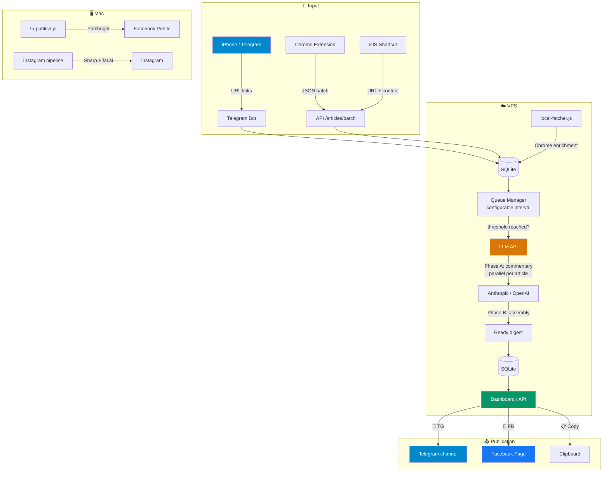
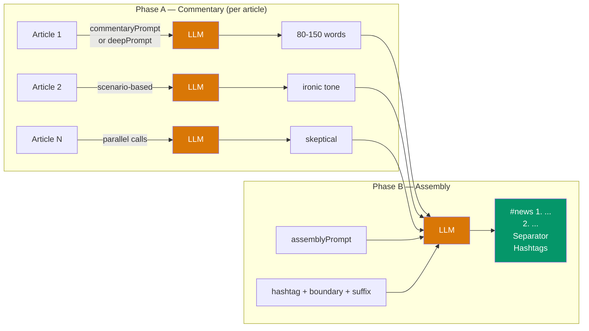
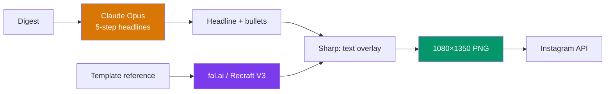
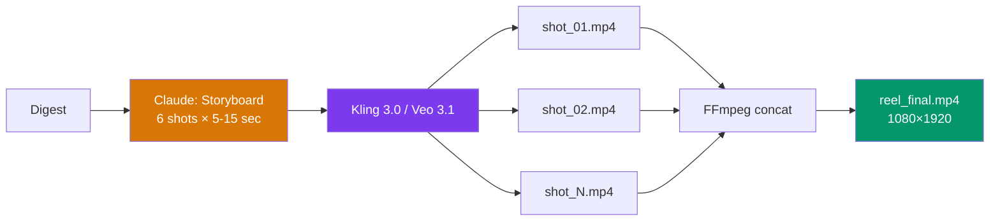

# News Digest Pipeline v2.0.4

[](CHANGELOG.md)
[](https://nodejs.org/)
[](https://www.anthropic.com/)
[](https://openai.com/)
[](https://www.docker.com/)
[](https://www.sqlite.org/)
[](LICENSE)
[](#)
[](#)

> Automated pipeline: collect news → generate author commentary via LLM → publish to Telegram, Facebook, Instagram.

---

<p align="center">
  
</p>

---

## How it Works

1. You have the **[Perplexity](https://perplexity.ai)** app installed on your phone — it has a convenient news digest (Discover).
2. Open Perplexity, go to Discover, and scroll through the news.
3. Find an interesting news item — click **"Share"** → **Telegram** → select your bot.
4. Once enough articles have accumulated (default: 13) — LLM automatically generates a digest, and a ready-to-publish text with publication buttons appears on the dashboard.
5. Go to the **Dashboard**, find the desired digest, and click where you want to publish: **📨 TG** (Telegram), **📘 FB** (Facebook), or both.

No manual copying, no layout work, no routine.

---

## Before Launching

| Step | Action | Instructions |
|-----|------------|-----------|
| 1 | Set up a **VPS server** (Ubuntu, Docker, Traefik) | [vps-setup.md](news-digest-pipeline/docs/vps-setup.md) |
| 2 | Create a **Telegram bot** via @BotFather and set up a webhook | [telegram-setup.md](news-digest-pipeline/docs/telegram-setup.md) |
| 3 | Get an **API key** — Claude at [console.anthropic.com](https://console.anthropic.com/) or OpenAI at [platform.openai.com](https://platform.openai.com) | — |
| 4 | *(optional)* Create a **Facebook App** and get a Page Access Token | [facebook-page-setup.md](news-digest-pipeline/docs/facebook-page-setup.md) |
| 5 | *(optional)* Set up **Facebook Profile** auto-publishing (Patchright) | [facebook-setup.md](news-digest-pipeline/docs/facebook-setup.md) |
| 6 | Fill out the `.env` file and run `docker compose up -d` | [Quick Start](#quick-start) |

---

## Architecture



---

## Quick Start

### 1. Fork and Clone

```bash
git clone https://github.com/YOUR_USERNAME/news.git
cd news/news-digest-pipeline
```

### 2. Configuration

```bash
cp .env.example .env
```

Fill in `.env`:

```env
# Required
LLM_VENDOR=anthropic                    # or "openai"
ANTHROPIC_API_KEY=sk-ant-...           # Claude API key
# OPENAI_API_KEY=sk-...                # OpenAI API key (if LLM_VENDOR=openai)
CLAUDE_MODEL=claude-opus-4-20250514    # or any supported model

TELEGRAM_BOT_TOKEN=123456:ABC...       # Token from @BotFather
TELEGRAM_CHAT_ID=123456789            # Your Telegram user ID

# Optional (for publication)
TELEGRAM_PUBLISH_CHAT_ID=-100...      # ID of the channel for publication
FACEBOOK_PAGE_ID=...                  # Facebook Page ID
FACEBOOK_PAGE_ACCESS_TOKEN=...        # Page Access Token

# Security
API_SECRET_KEY=...                    # Generate: openssl rand -base64 32
DASHBOARD_PASSWORD=...                # Separate password for the dashboard

# Optional (notifications, thresholds)
NTFY_TOPIC=...                        # ntfy.sh topic for push notifications
ARTICLE_THRESHOLD=13                  # Articles needed to auto-generate digest
CHECK_INTERVAL_MS=60000               # Queue check interval (default: 60 sec)
```

### 3. Launch

```bash
npm install
npm start
```

Dashboard: `http://localhost:3000` (login: `admin` / your `DASHBOARD_PASSWORD`)

### 4. Local Docker

Use this when you want to run the app on your own machine without Traefik or a VPS:

```bash
docker compose -f news-digest-pipeline/docker-compose.yml -f news-digest-pipeline/docker-compose.local.yml up -d --build
```

Open:

```text
http://localhost:3000
```

This local override:
- publishes port `3000`
- mounts the repo root as `/app/prompts` so the prompt files are visible
- keeps the production Traefik compose file unchanged

### 5. Production (Docker / VPS)

```bash
docker compose up -d --build
```

### 6. Restart

#### Production (Docker)
```bash
# Quick container restart
docker restart news-digest-pipeline

# Restart with rebuild (if you changed the code)
docker compose up -d --build
```

#### Local run (npm)
```bash
# Use the restart script
./scripts/restart-local.sh

# Or via npm
npm run restart:local
```

---

## How Generation Works



Three prompts control the style:
- **[prompt.md](prompt.md)** — how to write the commentary (tone, length, format)
- **[prompt_deep.md](prompt_deep.md)** — alternative "architect" scenario prompt (deeper analysis)
- **[assembly_prompt.md](assembly_prompt.md)** — how to assemble the digest (order, footer)
- **[config.md](config.md)** — hashtags, separator, boundary disclaimer

The active scenario (`sarcastic` or `architect`) is selected via the Dashboard Settings page or API.

---

## Dashboard

| Function | Description |
|---------|----------|
| 👁 **View** | Preview of the first 3 news items |
| 📨 **TG** | Publish to Telegram channel |
| 📘 **FB** | Publish to Facebook Page |
| 📋 **Copy** | Copy text to clipboard (marks as "copied") |
| ✕ **Delete** | Delete digest (articles return to "new" queue) |
| **Status** | Draft / Published / Copied (with date) |

Additional pages:
- **Settings** (`/settings.html`) — configure prompts, model, thresholds, scenarios
- **Articles** (`/articles.html`) — view and manage article queue

All dashboard pages must fit the screen width. No page may overflow the viewport horizontally (wrap long URLs/titles; constrain tables and toolbars).

Protected by HTTP Basic Auth + rate limiting.

---

## LLM Support

The pipeline supports both Anthropic (Claude) and OpenAI-compatible APIs:

| Vendor | Models | Configuration |
|--------|--------|---------------|
| Anthropic | `claude-opus-4-20250514`, `claude-sonnet-4-20250514`, etc. | `ANTHROPIC_API_KEY`, optional `ANTHROPIC_BASE_URL` |
| OpenAI | `gpt-4o`, `gpt-4o-mini`, `o3-mini`, etc. | `OPENAI_API_KEY`, optional `OPENAI_BASE_URL` |

Switch vendor: set `LLM_VENDOR=openai` (or `anthropic`) in `.env`.

Token usage and cost are tracked per digest and stored in the database.

---

## Facebook Profile (Browser Automation)

> **⚠️ WARNING: HIGH RISK OF ACCOUNT BAN**
>
> Automated publication to a **personal Facebook profile** via browser automation (Patchright, Playwright, Puppeteer, Selenium) **can lead to a silent ban of your account**. Facebook detects automation and without warning starts deleting all your posts — even those you publish manually. At the same time, Account Quality remains clean, with no notification of violation.
>
> **What we discovered from our own experience:**
> - Test posts via Patchright (especially with text like "test", "automation") triggered the spam filter.
> - The filter spread to ALL publications from the account — including manual ones.
> - The restriction even affected a second account from the same IP.
> - Recovery took 3-7 days of complete silence.
>
> **Recommendations:**
> - Publication to a **Facebook Page via API** is safe (Graph API, different moderation mechanism).
> - Publication to **Telegram** is safe (Bot API).
> - Publication to a **personal profile** — only manually (copy text from the dashboard).
> - **Never** publish test posts from your main account.
> - **Never** do rapid publish/delete cycles — this is the main trigger.
>
> Full research on the problem: [facebook-shadow-ban-research.md](news-digest-pipeline/docs/facebook-shadow-ban-research.md)

Code for browser automation is kept in the project as **experimental** — use at your own risk, only with test accounts:

```bash
# First time — log in
node scripts/fb-publish.js --login

# Publication (⚠️ RISK OF BAN — test accounts only!)
node scripts/fb-publish.js latest
```

More details: [docs/facebook-setup.md](news-digest-pipeline/docs/facebook-setup.md) — detailed description of the fight against Facebook bot detection.

---

## Media Pipelines

### Instagram (Images)



**Pipeline stages:**
1. **Rate** — score each news item by clickbait potential (0–10)
2. **Select** — pick the hottest story
3. **Headline** — transform into 8–10 word clickbait headline
4. **Summarize** — compress remaining news into 5–8 word phrases
5. **Compile** — combine headline + "А также: …" subtext

Run: `node production/image/src/headlines.js latest`

### Video (Reels / Shorts)



---

## API

All endpoints (except `/health`) require authentication: `Authorization: Bearer <API_SECRET_KEY>`

### Articles

| Method | Endpoint | Description |
|-------|----------|----------|
| `GET` | `/health` | Server status (public) |
| `GET` | `/` | Dashboard (Basic Auth) |
| `POST` | `/api/articles` | Add article by URL (fetches content, SSRF-protected) |
| `POST` | `/api/articles/batch` | Batch upload (extension/iOS Shortcut) |
| `GET` | `/api/articles` | List articles (optional `?status=&limit=`) |
| `GET` | `/api/articles/stats` | Counts by status |
| `PATCH` | `/api/articles/:id` | Update article title/content (local-fetcher enrichment) |
| `DELETE` | `/api/articles/:id` | Delete article |

### Digests

| Method | Endpoint | Description |
|-------|----------|----------|
| `POST` | `/api/digests/generate` | Manual generation (optional `{ articleIds: [] }`) |
| `GET` | `/api/digests` | List digests (optional `?status=`) |
| `GET` | `/api/digests/:id` | Single digest with articles |
| `GET` | `/api/digests/:id/text` | Plain text for copy-paste |
| `GET` | `/api/digests/latest/text` | Latest digest plain text |
| `POST` | `/api/digests/:id/publish` | Publish `{ platforms: ["telegram","facebook"] }` |
| `PATCH` | `/api/digests/:id` | Update digest content |
| `PATCH` | `/api/digests/:id/status` | Set status: `draft` or `published` |
| `PATCH` | `/api/digests/:id/mark-copied` | Mark as copied |
| `DELETE` | `/api/digests/:id` | Delete digest (articles return to queue) |

### Settings

| Method | Endpoint | Description |
|-------|----------|----------|
| `GET` | `/api/settings` | Get current config (prompts, model, thresholds) |
| `POST` | `/api/settings` | Update config fields |

### Telegram Webhook

| Method | Endpoint | Description |
|-------|----------|----------|
| `POST` | `/webhook/telegram` | Telegram Bot webhook (receives shared URLs) |

---

## Security

- API and Dashboard are protected by authentication (Bearer / Basic Auth).
- Separate keys for API and Dashboard.
- Rate limiting: 30 req/min (API), 10 attempts/15min (Dashboard).
- SSRF protection: whitelist only `perplexity.ai` for server-side fetch.
- Timing-safe key comparison (`crypto.timingSafeEqual`).
- `.env` is not in git, permissions `0600`.

Full audit: [SECURITY_AUDIT_2026-04-13.md](SECURITY_AUDIT_2026-04-13.md)

---

## Structure

```
├── prompt.md                       # Prompt: article commentary (sarcastic scenario)
├── prompt_deep.md                  # Prompt: deeper analysis (architect scenario)
├── assembly_prompt.md              # Prompt: digest assembly
├── config.md                       # Hashtags, separator, boundary disclaimer
│
├── news-digest-pipeline/
│   ├── src/
│   │   ├── index.js                # Express server + auth + rate limiting
│   │   ├── config.js               # Env → runtime config
│   │   ├── middleware/
│   │   │   └── auth.js             # Bearer + Basic Auth
│   │   ├── db/
│   │   │   ├── index.js            # SQLite helpers (better-sqlite3)
│   │   │   └── schema.sql          # Database schema
│   │   ├── routes/
│   │   │   ├── articles.js         # Article CRUD + batch
│   │   │   ├── digests.js          # Digest generation + publish
│   │   │   ├── settings.js         # Config read/update
│   │   │   ├── telegram.js         # Webhook handler
│   │   │   └── health.js           # Health check
│   │   ├── services/
│   │   │   ├── article-fetcher.js  # Perplexity content extraction
│   │   │   ├── digest-generator.js # Phase A + Phase B LLM calls
│   │   │   ├── queue-manager.js    # Auto-generation on threshold
│   │   │   ├── notifier.js         # ntfy.sh push notifications
│   │   │   ├── telegram-bot.js     # Telegram Bot API helpers
│   │   │   └── publishers/
│   │   │       ├── index.js        # Publish router
│   │   │       ├── telegram.js     # Telegram channel publish
│   │   │       ├── facebook.js     # Facebook Page Graph API
│   │   │       └── youtube.js      # YouTube Community (placeholder)
│   │   ├── data/
│   │   │   ├── model-catalog.js    # LLM pricing catalog
│   │   │   └── model-catalog.test.js
│   │   └── public/
│   │       ├── index.html          # Dashboard
│   │       ├── articles.html       # Article queue viewer
│   │       └── settings.html       # Config editor
│   ├── scripts/
│   │   ├── fb-publish.js           # Facebook Profile (Patchright)
│   │   ├── fb-profile-watcher.js   # launchd cron wrapper
│   │   ├── local-fetcher.js        # Chrome content extraction
│   │   ├── setup-cron.sh           # VPS cron setup
│   │   ├── setup-fb-watcher.sh     # launchd setup
│   │   ├── monitor.sh              # VPS monitoring
│   │   └── restart-local.sh        # Local restart
│   ├── production/
│   │   ├── image/                  # Instagram image pipeline
│   │   │   ├── src/
│   │   │   │   ├── headlines.js    # 5-step headline generation
│   │   │   │   ├── generate.js     # Image generation via fal.ai
│   │   │   │   └── overlay.js      # Sharp text overlay
│   │   ├── video/                  # Video pipeline research
│   │   └── audio/                  # Audio/TTS research
│   ├── distribution/
│   │   ├── telegram/               # Standalone Telegram publisher
│   │   ├── facebook-page/          # Standalone Facebook Page publisher
│   │   └── facebook-profile/       # Standalone FB Profile publisher
│   ├── docs/                       # Setup guides
│   ├── Dockerfile
│   └── docker-compose.yml
│
└── extension/                      # Chrome Extension
    ├── manifest.json
    ├── popup.html
    ├── popup.js
    ├── content.js
    ├── background.js
    └── icon*.png
```

---

## Documentation

| Topic | File |
|------|------|
| Telegram (Bot + Channel) | [telegram-setup.md](news-digest-pipeline/docs/telegram-setup.md) |
| Facebook Page (Graph API) | [facebook-page-setup.md](news-digest-pipeline/docs/facebook-page-setup.md) |
| Facebook Profile (Patchright) | [facebook-setup.md](news-digest-pipeline/docs/facebook-setup.md) |
| VPS + Docker + Traefik | [vps-setup.md](news-digest-pipeline/docs/vps-setup.md) |
| iOS Shortcut | [ios-shortcut-setup.md](news-digest-pipeline/docs/ios-shortcut-setup.md) |
| Instagram Pipeline | [instagram/README.md](news-digest-pipeline/instagram/README.md) |
| Facebook Shadow Ban Research | [facebook-shadow-ban-research.md](news-digest-pipeline/docs/facebook-shadow-ban-research.md) |

---

## Stack

| Component | Technology |
|-----------|-----------|
| Backend | Node.js 20, Express, SQLite (better-sqlite3) |
| AI | Anthropic SDK, OpenAI SDK — configurable vendor |
| Images | fal.ai, Recraft V3, Sharp |
| Video | Kling 3.0, Veo 3.1, FFmpeg |
| Browser | Patchright (stealth Playwright) |
| Deploy | Docker, Traefik, Ubuntu 24.04 |
| Notifications | Ntfy.sh |

---

## License

MIT