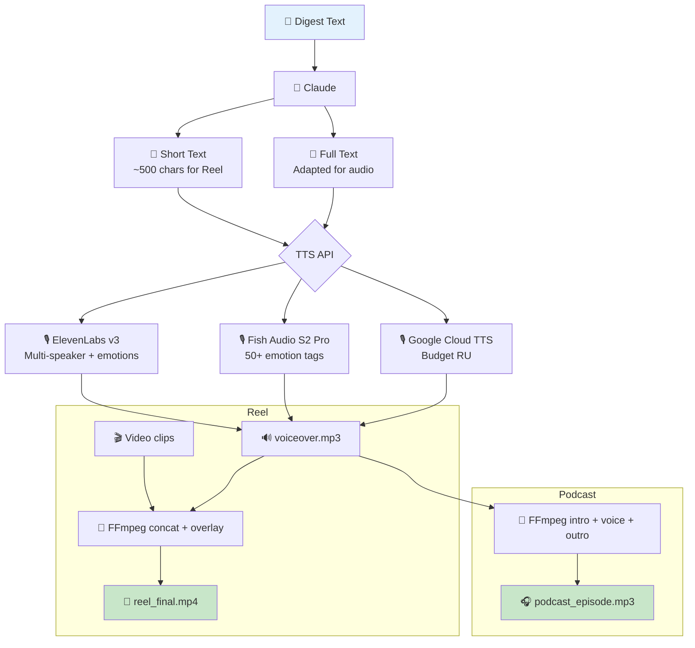

# Audio Pipeline — TTS Voice-Over for Reels + Podcast

**Status:** Research completed, ready for implementation

## Concept

Two scenarios:
1. **Voice-over for Reels** — short narration (~500 characters) to be overlaid on video.
2. **Podcast Format** — full digest text, intro/outro, publication to platforms.

## Architecture



## TTS Service Comparison (April 2026)

| Service | Russian | Emotions | Cloning | Price/mo (90 reels) | Quality |
|--------|---------|--------|-------------|---------------------|----------|
| **ElevenLabs v3** | ✅ | ✅ audio tags | ✅ from 60 sec | $22 (plan) | ⭐⭐⭐⭐⭐ |
| **Fish Audio S2 Pro** | ✅ | ✅ 50+ tags | ✅ from 15 sec | ~$12 | ⭐⭐⭐⭐⭐ |
| **Inworld TTS-1.5** | ❌ | ✅ | ✅ from 5 sec | $0.45 | ⭐⭐⭐⭐⭐ |
| **Cartesia Sonic-3** | ✅ | ✅ | ✅ from 3 sec | $5 (plan) | ⭐⭐⭐⭐ |
| **Voxtral TTS** | ✅ | ✅ | ✅ via API | $0.72 | ⭐⭐⭐⭐ |
| **Google Cloud TTS** | ✅ | SSML | ⚠️ Enterprise | $0.72 | ⭐⭐⭐⭐ |
| **MiniMax Speech-02** | ✅ | ✅ | ✅ $1.5/voice | $2.25 | ⭐⭐⭐⭐ |

## Recommendations

| Priority | Service | Why | Price |
|-----------|--------|--------|------|
| **Primary** | **ElevenLabs Flash v2.5** | Multi-speaker, emotions, Professional Clone, 70+ languages | $22/mo |
| **Budget + RU** | **Google Cloud TTS Neural** | Stable Russian, SSML | $0.72/mo |
| **Quality + Price** | **Fish Audio S2 Pro** | #1 TTS-Arena2, 50+ emotion tags, cross-lingual clone | ~$12/mo |
| **Self-host** | **Resemble Chatterbox** | MIT, zero-shot clone, Russian | $1-3/mo GPU |

## FFmpeg Integration

```bash
# Voice-over on video
ffmpeg -i reel_video.mp4 -i voiceover.mp3 \
  -filter_complex "[1:a]volume=1.5[a1];[0:a][a1]amix=inputs=2:duration=first" \
  -c:v copy reel_final.mp4

# Podcast: intro + voice + outro
ffmpeg -i intro.mp3 -i voiceover.mp3 -i outro.mp3 \
  -filter_complex "[0:a][1:a][2:a]concat=n=3:v=0:a=1[out]" \
  -map "[out]" podcast_episode.mp3
```

## Voice Cloning (One-time)

1. Record 1-5 minutes of audio with the target voice.
2. Upload to ElevenLabs → get `voice_id`.
3. Use `voice_id` in all generations.

## Structure

```
distribution/audio/
├── README.md                # This file
├── research-tts-apis.md     # Full TTS API research
├── voice-samples/           # Samples for cloning
└── src/
    ├── generate-voiceover.js
    └── overlay-audio.js     # FFmpeg wrapper
```
