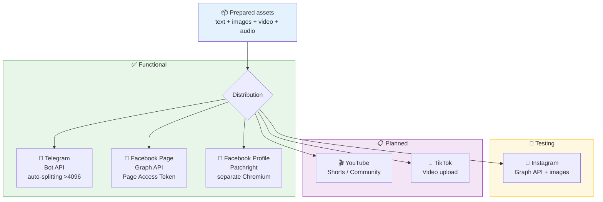
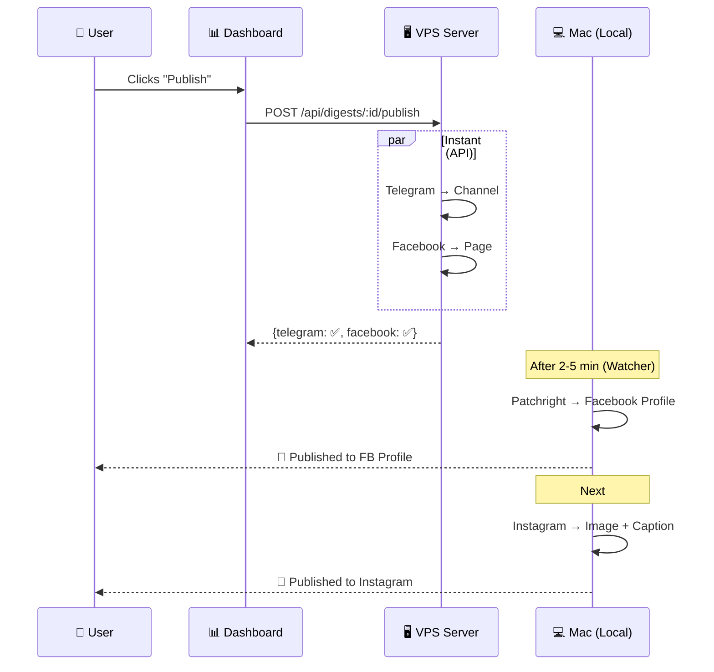

# Distribution Pipeline — Multi-platform Distribution

**Input:** Prepared media assets (text, images, video, audio)  
**Output:** Published to various platforms

## Architecture



## Distribution Channels

| Channel | Method | Content Type | Status |
|-------|-------|-------------|--------|
| **Telegram** | Bot API | Text | ✅ Functional |
| **Facebook Page** | Graph API | Text | ✅ Functional |
| **Facebook Profile** | Patchright | Text | 🧪 Testing |
| **Instagram** | Graph API / Patchright | Image + Text | 📋 Planned |
| **YouTube** | Patchright | Video / Community | 📋 Planned |
| **TikTok** | API / Patchright | Video | 📋 Planned |

## Publication Sequence



## Structure

```
distribution/
├── README.md               # This file
├── telegram/
│   ├── telegram.js          # Publisher: Bot API + message splitting
│   └── telegram-setup.md    # Setup documentation
├── facebook-page/
│   ├── facebook.js          # Publisher: Graph API
│   └── facebook-page-setup.md
├── facebook-profile/
│   ├── fb-publish.js        # Patchright automation
│   ├── fb-profile-watcher.js # Automatic watcher (launchd)
│   └── facebook-setup.md    # Documentation
├── instagram/               # TODO
│   └── README.md
├── youtube/                 # TODO
│   └── README.md
└── tiktok/                  # TODO
    └── README.md
```

## Environment Variables

```env
# Telegram
TELEGRAM_BOT_TOKEN=...
TELEGRAM_PUBLISH_CHAT_ID=-100...  # Channel (with -100 prefix)

# Facebook Page
FACEBOOK_PAGE_ID=YOUR_FACEBOOK_PAGE_ID
FACEBOOK_PAGE_ACCESS_TOKEN=...    # Page token (not User token!)

# Facebook Profile
# Session stored in .fb-profile/ (Patchright persistent context)

# Instagram (TODO)
INSTAGRAM_BUSINESS_ACCOUNT_ID=...
```
