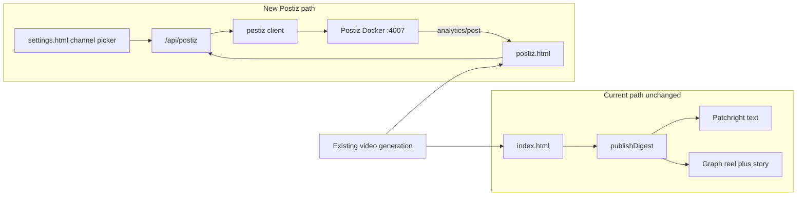

# V3 Improvement Phase — Parallel Postiz publish path

Status: implemented.  
Date: 2026-08-15.

Add an opt-in Postiz publishing path for Facebook text, Reels, and Stories against local Docker at `http://localhost:4007`, with selectable Postiz channels in `.env` / Settings and per-digest sparkline stats from Postiz analytics. Current dashboard buttons stay unchanged.

## Context

Local Postiz is already running at [http://localhost:4007](http://localhost:4007) with two Facebook pages connected, including **Nise-ua** (`cmst7e4tv0001qo8gzublv4ev`) and **З любов'ю до України…**. There is no Postiz code in this repo today. The existing dashboard (`📘 FB` / `📽️ Reel`) stays on the current publishers.



## Isolation rules

Do **not** change:

- [`src/services/publishers/index.js`](../src/services/publishers/index.js) `publishDigest`
- Facebook browser/Graph publishers
- Digest row buttons in [`src/public/index.html`](../src/public/index.html)
- Video generation (`generate-video` / reel CLI)

Additive only: new files, one header link, settings Postiz section, env keys, DB column.

## Switch property and channel selection

New env/config (default keeps current behavior):

- `PUBLISH_BACKEND=legacy|postiz` (default `legacy`)
- `POSTIZ_API_URL=http://localhost:4007`
- `POSTIZ_API_KEY` (Postiz Settings → Developers; secret, `.env` only)
- `POSTIZ_CHANNEL_IDS` — comma-separated Postiz integration IDs to publish to (example: `cmst7e4tv0001qo8gzublv4ev`)

Channels are an explicit allowlist, not “all connected Postiz accounts”.

Wire like `REEL_FRAME_MODE`:

- [`src/config.js`](../src/config.js) — parse `POSTIZ_CHANNEL_IDS` into `postizChannelIds: string[]`
- [`src/routes/settings.js`](../src/routes/settings.js) — `ENV_WRITABLE` for `PUBLISH_BACKEND`, `POSTIZ_API_URL`, `POSTIZ_CHANNEL_IDS` (API key stays masked/read-only)
- Settings **Публікація** panel:
  - backend select (`legacy` / `postiz`)
  - Postiz URL
  - masked API key status
  - live checkbox list from `GET /api/public/v1/integrations` (name, platform, picture)
  - saving writes selected IDs to `POSTIZ_CHANNEL_IDS`
  - warn if a saved ID is no longer connected
- Publish APIs refuse unless `PUBLISH_BACKEND=postiz`, key/URL are set, and **at least one** selected channel ID is still connected

A Text/Reel/Story action publishes **the same payload to every selected channel** in one `POST /posts` (`posts[]` one entry per integration). Provider `settings.__type` comes from each integration’s `platform` (facebook vs later instagram/youtube, etc.). Facebook-specific `post_type` (`post` / `story`) applies only when `platform === "facebook"`; Instagram uses the same `post` / `story` enum from Postiz docs.

## New operator page

Add [`src/public/postiz.html`](../src/public/postiz.html). Copy header/styles from `index.html`. Add one nav link on existing pages (`Postiz`).

Page behavior:

- List recent digests (`GET /api/digests`)
- Show the complete digest text in an editable text area (not a truncated row preview)
- Save edits with the existing `PATCH /api/digests/:id` content contract before publishing
- Generate or regenerate the Facebook reel from the same row with `POST /api/digests/:id/generate-video`
- Poll `GET /api/digests/video-jobs/:jobId` and show progress, errors, and the finished video link
- Per digest row: **Text**, **Reel**, **Story**
- Reel/Story stay disabled until a generated video exists
- Show selected channel names
- **Small graphs next to each digest** (see below)
- Status banner when backend is still `legacy`

## Per-digest stats graphs (Postiz)

Postiz post analytics: `GET /api/public/v1/analytics/post/{postId}?date=7` returns series such as Likes / Comments / Impressions (`label`, `data[{total,date}]`, `percentageChange`). Facebook Page is in the supported set (7/30/90 days).

On each digest row in `postiz.html`:

- Compact sparklines (inline SVG, no chart library) for 2–3 metrics: impressions/views, likes/engagement, comments if present
- One mini-block per selected channel that has a stored Postiz post id
- Empty/placeholder if the digest was not published via Postiz yet
- Default window: 7 days

Backend:

- `GET /api/postiz/digests/:id/stats?days=7` fans out to Postiz per stored post id, returns a small normalized payload for the UI
- Short in-memory cache (~5 min) so listing many digests does not hammer Postiz
- If `releaseId` is `"missing"`, show “stats unavailable” rather than a broken chart (Postiz needs a connected release id for analytics)

Do **not** add these graphs to `index.html` (keeps the current dashboard layout).

## New API (do not overload `/api/digests/:id/publish`)

Mount in [`src/index.js`](../src/index.js) after `apiAuth`, with `publishLimiter` on publish:

- `GET /api/postiz/status` — flag, masked key, live integrations, selected channel IDs
- `GET /api/postiz/digests/:id/stats`
- `POST /api/postiz/digests/:id/publish` body `{ kind: "text" | "reel" | "story" }`

## Publisher implementation

New module [`src/services/publishers/postiz.js`](../src/services/publishers/postiz.js) plus a thin `fetch` client against `{POSTIZ_API_URL}/api/public/v1` (not `@postiz/node`).

- Auth: `Authorization: <POSTIZ_API_KEY>`
- Upload MP4: `POST /upload` multipart (do not pass `localhost:3000` video URLs into Docker)
- Create: `POST /posts` with `type: "now"` and one `posts[]` item per selected channel

Facebook payloads (when that channel’s platform is `facebook`):

| Kind | Media | Settings | Postiz behavior |
|------|-------|----------|-----------------|
| Text | none | `{ "__type": "facebook", "post_type": "post" }` | Graph Page post |
| Reel | local MP4 uploaded first | `{ "__type": "facebook", "post_type": "post" }` | mp4 → `media_type=REELS` |
| Story | same MP4, trim to ≤59s | `{ "__type": "facebook", "post_type": "story" }` | each attachment is its own story |

Reel caption: keep [`buildReelCaption`](../src/services/publishers/facebook-caption.js) when `facebook_post_id` exists; otherwise minimal caption.

Persist JSON column `postiz_posts` (`schema.sql` + `initDb()` `ALTER` + `updateDigest` allowlist), shape:

```json
{
  "text": [{ "integrationId": "...", "postId": "...", "releaseURL": "..." }],
  "reel": [],
  "story": []
}
```

Also fill `facebook_post_id` / `facebook_reel_id` / `facebook_story_id` from the **first** Facebook `releaseURL` when present, so existing chips still work. Text success still sets `status: published` + `published_at`.

## Text-visibility risk (must document)

Today digest **text** uses Patchright because Graph `/feed` is silently hidden from followers ([`facebook-page-setup.md`](facebook-page-setup.md)). Postiz also publishes Facebook text via Graph.

- After text publish, if `FACEBOOK_PAGE_ACCESS_TOKEN` is set, run `verifyPublishedFacebookPost` and warn on the Postiz page
- Postiz Facebook app must be **Live**
- Do not fall back to the browser composer

## Tests and docs

New Vitest: [`src/services/publishers/postiz.test.js`](../src/services/publishers/postiz.test.js) — payload shape for multiple channels, channel-allowlist gating, upload-then-post, story trim, `postiz_posts` mapping, stats payload normalization. Mock `fetch`; do not hit live Postiz.

**Adjust existing tests** (required; do not leave the current suite failing around the new config/DB fields):

- [`src/config.test.js`](../src/config.test.js) — extend for `PUBLISH_BACKEND` / `POSTIZ_CHANNEL_IDS` normalizers (default `legacy`, comma-split IDs, ignore blanks). Same style as `normalizeReelFrameMode`.
- [`src/services/publishers/publish-digest.test.js`](../src/services/publishers/publish-digest.test.js) — keep all current Facebook/YouTube cases green. Add a case that `publishDigest` never writes `postiz_posts` and never calls the Postiz client, including when `platforms` is omitted (legacy path only).
- [`src/db/index.js`](../src/db/index.js) `updateDigest` allowlist — if any test asserts the allowed columns, add `postiz_posts`. Digest fixtures that list columns must include the new field or ignore unknown keys.
- Settings payload — if a test snapshots `GET /api/settings` `publishing`, update it for the Postiz subsection without changing Telegram/Facebook secret masking behavior.
- [`src/services/video-generator.test.js`](../src/services/video-generator.test.js) and production-lib tests — only touch if they fail because of shared `updateDigest` / config mocks; do not “fix” unrelated reel tests.

Gate: from `news-digest-pipeline/`, `npm test` then `npm run test:all`. Follow [`testing.md`](testing.md).

Also write [`postiz-publish.md`](postiz-publish.md) (during implementation) and [`.env.example`](../.env.example) keys.

## Implementation todos

1. Add `PUBLISH_BACKEND`, Postiz URL/key, and `POSTIZ_CHANNEL_IDS` plus settings channel picker.
2. Thin Postiz HTTP client + text/reel/story publisher to all selected channels, with local MP4 upload.
3. Add `/api/postiz` routes, JSON `postiz_posts` column, `postiz.html` with sparkline stats per digest.
4. New Postiz Vitest plus adjust existing tests (`config.test.js`, `publish-digest.test.js`, db/settings fixtures); `docs/postiz-publish.md`.

## Operator flow after this ships

1. Leave `PUBLISH_BACKEND=legacy` until ready.
2. Put `POSTIZ_API_KEY` in `.env`, confirm Postiz at `:4007`.
3. In Settings → Публікація, tick the exact Postiz channels to use (e.g. only Nise-ua).
4. Set `PUBLISH_BACKEND=postiz`.
5. Open **Postiz**, review the full text, edit it if needed, and save.
6. Generate the reel beside that digest and wait for the inline progress/result.
7. Publish **Text**, **Reel**, or **Story** from the same digest row; sparklines appear after Postiz has analytics.

The legacy `index.html` workflow remains unchanged and is available as a
fallback. Operators do not need to switch between the legacy dashboard and
Postiz to edit text or generate a reel for Postiz publishing.
