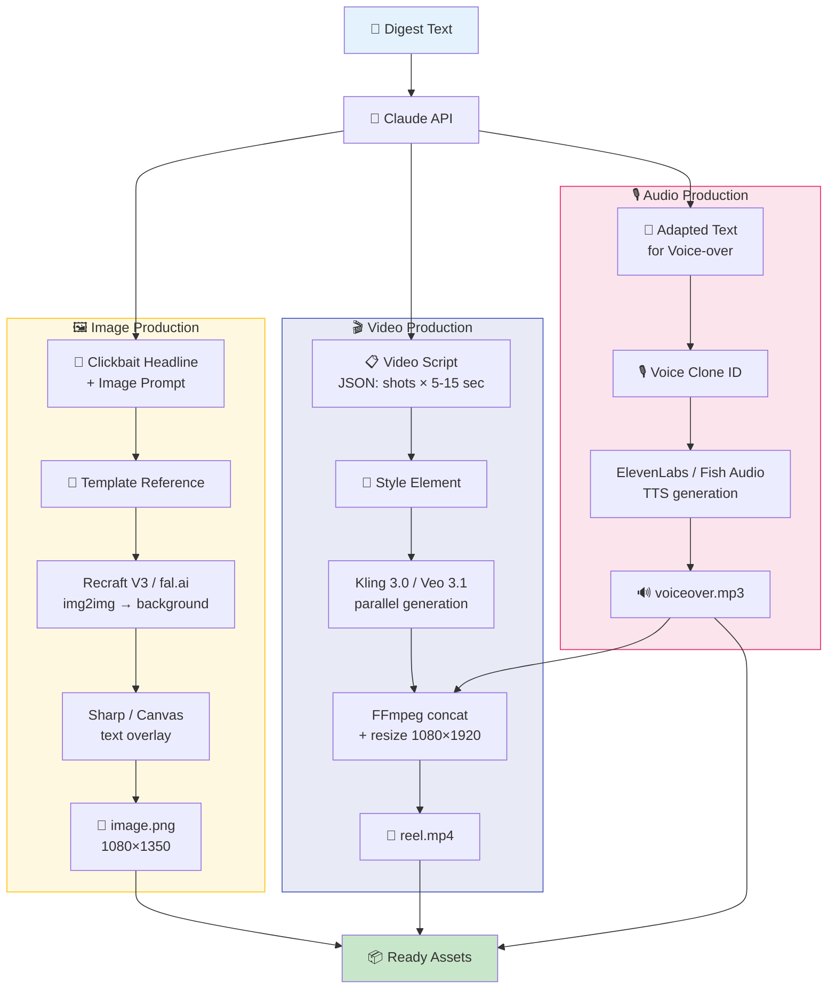

# Media Production Pipeline

**Input:** Digest text  
**Output:** Ready media assets (images, video, audio)

## Architecture



## Components

| Component | Service | Price/unit | Status |
|-----------|--------|---------|--------|
| **Image** | Recraft V3 (fal.ai) | $0.04/img | 📋 Research |
| **Video** | Kling 3.0 (EvoLink) | $0.075/sec | 📋 Research |
| **Audio** | ElevenLabs Flash v2.5 | $22/mo plan | 📋 Research |

## Structure

```
production/
├── README.md           # This file
├── image/
│   ├── README.md       # Image pipeline architecture
│   ├── research-image-apis.md
│   ├── templates/      # Template references
│   ├── fonts/          # Fonts for text
│   ├── output/         # Ready images
│   └── src/            # Generation scripts
├── video/
│   ├── README.md       # Video pipeline architecture
│   ├── research-video-apis.md
│   ├── templates/      # Style references
│   ├── output/         # Ready videos
│   └── src/            # Generation scripts
└── audio/
    ├── README.md       # Audio pipeline architecture
    ├── research-tts-apis.md
    ├── voice-samples/  # Samples for cloning
    └── src/            # Generation scripts
```
