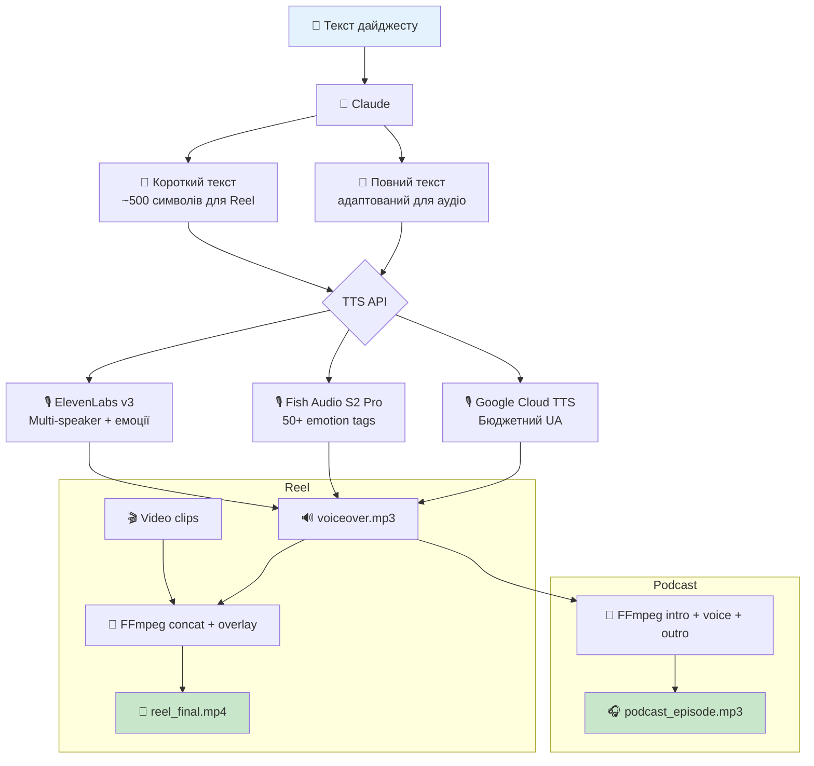

# Audio Pipeline — TTS Voice-Over для Reels + Подкаст

**Статус:** Дослідження завершено, готовий до реалізації

## Концепція

Два сценарії:
1. **Voice-over для Reels** — коротка озвучка (~500 символів) для накладання на відео
2. **Подкаст-формат** — повний текст дайджесту, intro/outro, публікація на платформи

## Архитектура



## Порівняння TTS-сервісів (квітень 2026)

| Сервіс | Українська | Емоції | Клонування | Ціна/міс (90 рілсів) | Якість |
|--------|-----------|--------|-----------|---------------------|--------|
| **ElevenLabs v3** | ✅ | ✅ audio tags | ✅ з 60 сек | $22 (план) | ⭐⭐⭐⭐⭐ |
| **Fish Audio S2 Pro** | ✅ | ✅ 50+ tags | ✅ з 15 сек | ~$12 | ⭐⭐⭐⭐⭐ |
| **Inworld TTS-1.5** | ❌ | ✅ | ✅ з 5 сек | $0.45 | ⭐⭐⭐⭐⭐ |
| **Cartesia Sonic-3** | ✅ | ✅ | ✅ з 3 сек | $5 (план) | ⭐⭐⭐⭐ |
| **Voxtral TTS** | ✅ | ✅ | ✅ через API | $0.72 | ⭐⭐⭐⭐ |
| **Google Cloud TTS** | ✅ | SSML | ⚠️ Enterprise | $0.72 | ⭐⭐⭐⭐ |
| **MiniMax Speech-02** | ✅ | ✅ | ✅ $1.5/голос | $2.25 | ⭐⭐⭐⭐ |
| **Yandex SpeechKit** | ❌ | SSML | ⚠️ Brand Voice | $0.50 | ⚠️ оплата з US |

## Рекомендації

| Пріоритет | [PERSON_NAME] | Чому | Ціна |
|-----------|--------|------|------|
| **Основний (робочий, 2026)** | **edge-tts `uk-UA-PolinaNeural`** | Природний нейроголос, безкоштовно, без API-ключів; запуск `uvx edge-tts` | $0 |
| **Premium (опційно)** | **ElevenLabs Flash v2.5** | Multi-speaker, емоції, Professional Clone, 70+ мов | $22/міс |
| **Бюджетний** | **Google Cloud TTS Neural** | Стабільна українська, SSML | $0.72/міс |
| **Якість + ціна** | **Fish Audio S2 Pro** | #1 TTS-Arena2, 50+ emotion tags, cross-lingual clone | ~$12/міс |
| **Self-host** | **Resemble Chatterbox** | MIT, zero-shot clone, українська | $1-3/міс GPU |

> **Примітка (робочий стан):** продакшн-пайплайн відео (UI кнопка) за замовчуванням використовує
> `uvx edge-tts --voice uk-UA-PolinaNeural` — природний, людський український голос безкоштовно.
> Якщо в `.env` є `ELEVENLABS_API_KEY`, автоматично вмикається ElevenLabs. Голос «Google Translate»
> (роботизований) більше не використовується.
>
> ```
> uvx edge-tts --text "Текст новини" --voice uk-UA-PolinaNeural --write-media out.mp3
> ```

## FFmpeg інтеграція

```bash
# Voice-over на відео
ffmpeg -i reel_video.mp4 -i voiceover.mp3 \
  -filter_complex "[1:a]volume=1.5[a1];[0:a][a1]amix=inputs=2:duration=first" \
  -c:v copy reel_final.mp4

# Подкаст: intro + voice + outro
ffmpeg -i intro.mp3 -i voiceover.mp3 -i outro.mp3 \
  -filter_complex "[0:a][1:a][2:a]concat=n=3:v=0:a=1[out]" \
  -map "[out]" podcast_episode.mp3
```

## Voice Cloning (один раз)

1. Записати 1-5 хвилин аудіо фірмовим голосом
2. Завантажити в ElevenLabs → отримати `voice_id`
3. Використовувати `voice_id` у всіх генераціях

## Структура

```
distribution/audio/
├── README.md                # Цей файл
├── research-tts-apis.md     # Повне дослідження TTS API
├── voice-samples/           # Зразки для клонування
└── src/
    ├── generate-voiceover.js
    └── overlay-audio.js     # FFmpeg wrapper
```
