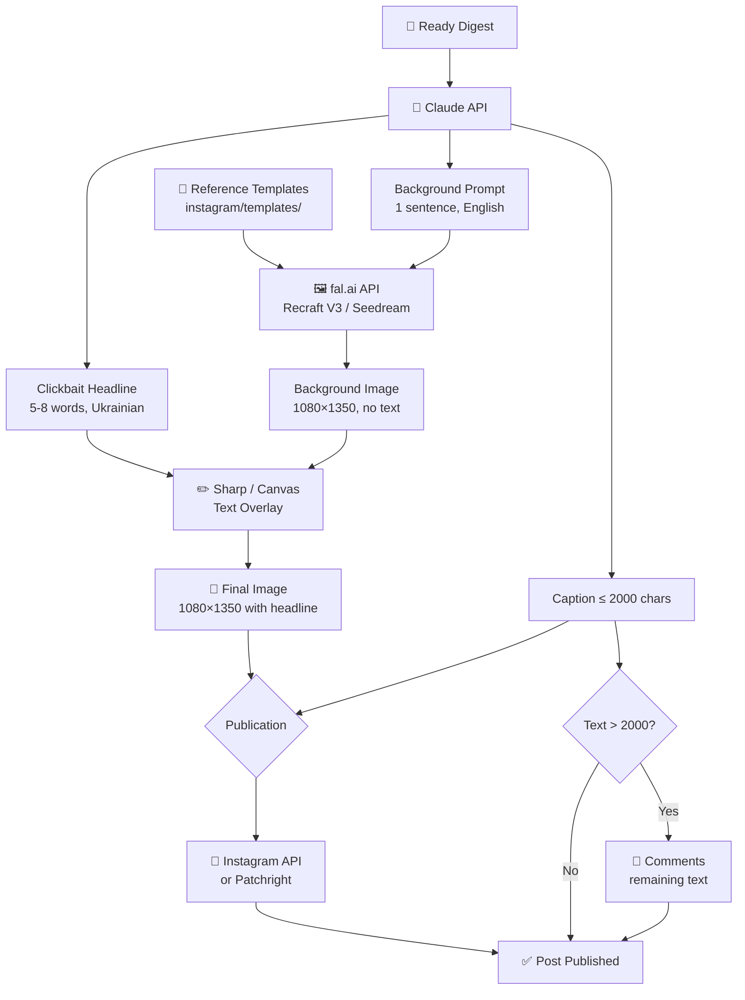

# Instagram Pipeline

## Scenario

Once the digest is ready and published to Telegram + Facebook, it should also be published to Instagram. Instagram is a visual platform, so a unique image with a clickbait headline is created for each digest.

## Full Publication Scenario

### Input
- Ready digest (text from DB, 2000-10000 characters).
- A set of reference templates (2-10 images defining the style).

### Step 1: Generate Headline and Prompt
**Who:** Claude API (same one that generates the digest).

Based on the digest text, Claude generates:
- **Clickbait headline** (5-8 words, Ukrainian) — for image overlay.
- **Background prompt** (1 sentence, English) — for image generation.
- **Shortened caption** (up to 2000 characters) — for the post description.

Example:
```
Headline: "AI fired 80% of the department. Boss doesn't regret it."
Prompt: "Dark corporate office with empty desks and glowing screens, cinematic moody lighting"
Caption: "#news 1. IgniteTech fired 80% of employees... [first 2000 characters]"
```

### Step 2: Select Reference Template
**Who:** Script (random selection).

A random template is chosen from the `instagram/templates/` folder. Templates define:
- Color palette.
- Style (minimalism, neon, editorial, etc.).
- Composition (where text and background are placed).

### Step 3: Generate Background Image
**Who:** fal.ai API → Recraft V3 (or Seedream 5 Lite).

Request: Template as style reference + prompt from Step 1.
Result: Unique 1080×1350 (4:5) image in the template's style.
Time: ~10-15 seconds.
Cost: ~$0.04.

**Important:** The image is WITHOUT text — only the background/atmosphere.

### Step 4: Text Overlay
**Who:** Local, Sharp (Node.js) or node-canvas.

The following is programmatically overlaid on the generated background:
- Clickbait headline (large font, Cyrillic support).
- Semi-transparent backing for contrast.
- Logo/branding (optional).

Text is overlaid **programmatically** — 100% control over spelling, font, and position.

Result: Final 1080×1350 PNG image.

### Step 5: Prepare Caption
**Who:** Script.

- First ~2000 characters of the digest → caption.
- Hashtags at the end (#news #AI #AI etc.).
- If the digest is longer than 2000 characters → the rest is saved for comments.

### Step 6: Publication to Instagram
**Who:** Instagram Graph API or Patchright.

**Option A — Instagram Graph API** (for Business/Creator accounts):
1. Upload image to a public URL.
2. POST create media container.
3. POST publish.

**Option B — Patchright** (for personal accounts):
- Same approach as Facebook Profile.
- Separate Chromium instance, persistent session.

### Step 7: Publish Remainder in Comments
**Who:** Instagram Graph API or Patchright.

If digest text > 2000 characters:
- Split the remainder into ~2000 character parts.
- Publish as comments to the post.
- 30-60 second delay between comments.

## Architectural Diagram



## Folder Structure

```
instagram/
├── README.md              # This file
├── templates/             # Reference templates (PNG)
│   ├── template-01.png
│   └── template-02.png
├── output/                # Generated images
├── src/
│   ├── generate-image.js  # Steps 2-4: template → fal.ai → overlay text
│   ├── prepare-caption.js # Step 5: text → caption + remainder
│   └── publish.js         # Steps 6-7: publication + comments
└── fonts/                 # Fonts for text overlay
    └── ...
```

## Configuration

```env
# fal.ai
FAL_KEY=...

# Instagram (if via API)
INSTAGRAM_ACCOUNT_ID=...
INSTAGRAM_ACCESS_TOKEN=...
```

## Costs

| Component | Price per Post | 30 Posts/mo |
|-----------|-------------|---------------|
| Claude API (headline + prompt) | ~$0.01 | $0.30 |
| fal.ai (background generation) | ~$0.04 | $1.20 |
| Sharp (text overlay) | $0 | $0 |
| **Total** | **~$0.05** | **~$1.50** |
