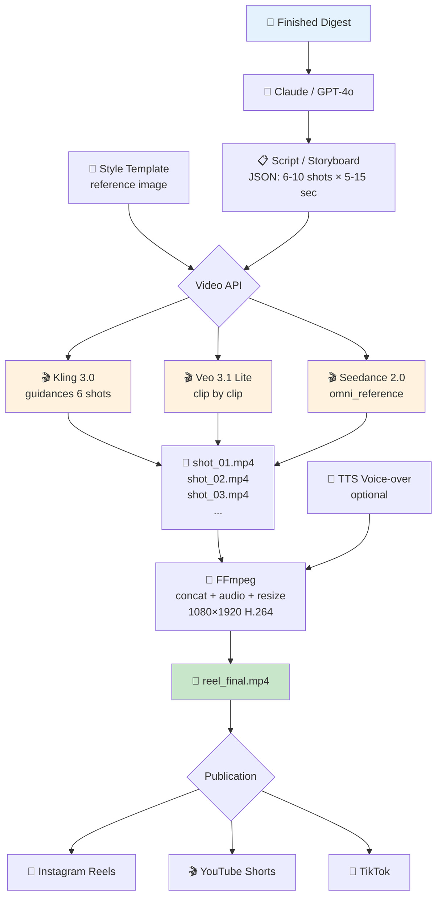

# Video Pipeline — Instagram Reels / YouTube Shorts

**Status:** Research completed, ready for implementation

## Concept

Automatic generation of 15-90 second videos from the digest for Instagram Reels, YouTube Shorts, and TikTok. Each clip is 5-15 seconds long, stitched locally via FFmpeg.

## Architecture



## Model Comparison (April 2026)

| Model | Storyboard API | Style ref | 9:16 | Audio | Max Dur. | Price/sec | 60s Reel |
|--------|---------------|-----------|------|-------|-------------|----------|----------|
| **Kling 3.0** | ✅ 6 shots | ✅ Elements 3.0 | ✅ | ✅ | 15 sec | $0.075 | $4.50 |
| **Veo 3.1 Lite** | ❌ | ✅ 3 ref img | ✅ | ✅ | 8 sec | $0.05-0.08 | $3.00-4.80 |
| **Seedance 2.0** | ⚠️ auto | ✅ 12 ref files | ✅ | ✅ | 15 sec | $0.081 | $4.86 |
| **Runway Gen-4.5** | ❌ | ✅ single ref | ✅ | ❌ | 10 sec | ~$0.12 | $7.20 |

## Recommended Stack

### Primary: Kling 3.0 (EvoLink)
- **Why:** The only one with a multi-shot `guidances[]` API — the entire storyboard in one call.
- **Elements 3.0:** Upload template once → `element_id` for all generations.
- **Native Audio** synchronized.
- **$0.075/sec** via EvoLink.

### Backup: Veo 3.1 Lite (Gemini API)
- **Why:** Cheapest ($0.05/sec@720p), integration with Gemini SDK.

## Pipeline Steps

### Step 1: Script Generation
Claude/GPT-4o creates a JSON storyboard from the digest text:
```json
{
  "shots": [
    {"shot": 1, "prompt": "Tech cityscape at night, glowing data streams, slow push-in", "duration": 8},
    {"shot": 2, "prompt": "Abstract network nodes connecting, deep blue tones", "duration": 7}
  ]
}
```

### Step 2: Style Registration
Upload a reference image (brand template) → get `element_id` (Kling) or pass `reference_images` (Veo).

### Step 3: Parallel Clip Generation
All shots are generated in parallel via asyncio. Time: 5-15 minutes.

### Step 4: FFmpeg Assembly
```bash
ffmpeg -y -f concat -safe 0 -i concat_list.txt \
  -c:v libx264 -crf 23 -preset fast \
  -c:a aac -b:a 128k \
  -vf "scale=1080:1920:force_original_aspect_ratio=decrease,pad=1080:1920:-1:-1" \
  -movflags +faststart \
  reel_final.mp4
```

### Step 5: Publication
Instagram Graph API → POST /media (video upload) → POST /media_publish

## Structure

```
production/video/
├── README.md                # This file
├── research-video-apis.md   # Full research
├── templates/               # Style reference images
├── output/                  # Finished reels
└── src/
    ├── storyboard.js        # Claude → JSON script
    ├── generate-clips.js    # Kling/Veo API → MP4 clips
    ├── stitch.js            # FFmpeg concatenation
    └── publish.js           # Instagram/YouTube upload
```

## Risks

- **Generation Time:** 5-15 minutes per clip.
- **Style Drift:** Differences between clips. Solution: Elements 3.0.
- **Audio Alignment:** Native audio may not transition smoothly. Solution: separate audio track.
