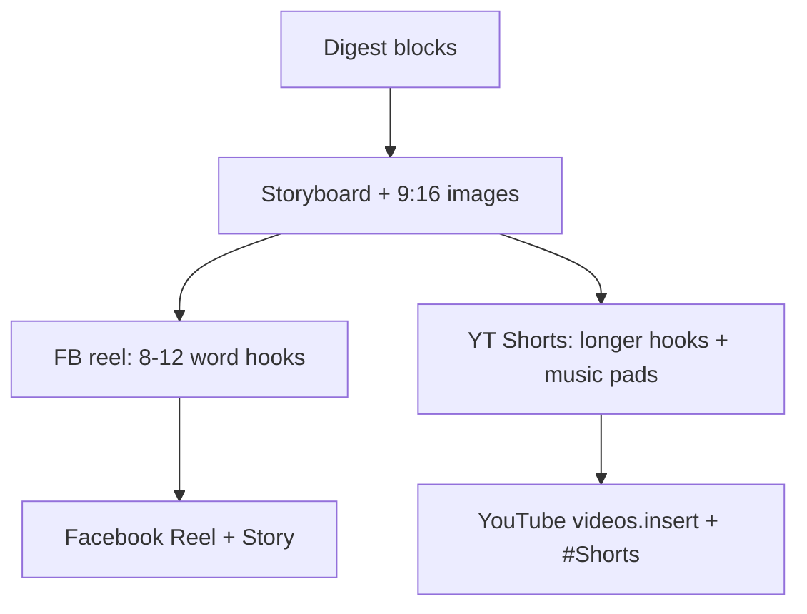

# YouTube Shorts from existing reel pipeline

## What already fits Shorts

The current reel is already Shorts-shaped: 1080×1920 9:16 H.264/AAC MP4 with Ukrainian TTS, no in-video CTA, and one shot per digest block. YouTube classifies a Short automatically when the file is vertical/square and **≤ 3 minutes** (1–2 min is well inside the cap). There is no dedicated Shorts endpoint — upload with `videos.insert` and put `#Shorts` in title/description.

**Measured duration today** (not a full 13–17 digest): recent reels are **~17–21s / 4–5 stories**; historical full-digest max ~66–68s. Facebook Story publish already **hard-trims at 59s**, so the FB reel must stay short. A 1–2 min YouTube cut therefore needs **much more narration + music pad per shot**, not a small bump from 8–12 words.

Today’s gaps:

- [`youtube.js`](news-digest-pipeline/src/services/publishers/youtube.js) is a **Community Posts placeholder** and does not upload video. No `googleapis`, no refresh-token OAuth (only unused `YOUTUBE_ACCESS_TOKEN` + `YOUTUBE_CHANNEL_ID`).
- Music beds are a hardcoded **36s** synth in [`background-music.js`](news-digest-pipeline/production/video/src/background-music.js), then hard-looped in [`stitch.js`](news-digest-pipeline/production/video/src/stitch.js).
- Storyboard `spokenText` is locked to **8–12 words (~4–6s)** in [`storyboard.js`](news-digest-pipeline/production/video/src/storyboard.js) — Facebook pacing.
- Digest stores one `video_url` / `reel_url`, used by Facebook Reel. A second cut must not overwrite that.



## 1. Separate Shorts generation cut

Keep default `generate-reel.js` / UI “Generate video” as the Facebook reel.

Add `--format shorts` (CLI + API):

```bash
node production/video/src/generate-reel.js latest --format shorts
node production/video/src/generate-reel.js <digest-id> --format shorts --images-only
```

**Pacing (YouTube only)** — sized for today’s **4–5 block** digests hitting **60–120s**, and for occasional 13–17 block digests staying **< 180s**:

- `spokenText`: **18–30 Ukrainian words** (~12–18s per shot), still complete factual sentences (1–2), still one shot per digest block. `detailText` can be 1–2 short sentences so on-screen text matches the longer VO.
- After each TTS clip, hold the still **1.5–3s** (music-only interstitial) so the bed is clearly audible between stories.
- **4–6s music-only intro/outro** using the first/last frame (no new images, no CTA).
- Example with 5 shots: intro 5s + 5×(14s VO + 2s pad) + outro 5s ≈ **90s**. Stretch VO toward 18s and pads toward 3s to approach **2 min**.
- Hard stop **< 180s** (Shorts max): if projected runtime is high (many blocks), drop intro/outro first, then shorten pads, then keep spoken length closer to 18 words. Never subset or merge digest blocks. Do not change Facebook Story’s 59s trim.

**Output:** `production/video/output/shorts_<timestamp>.mp4` (do not use `reel_` prefix). Persist on the digest as a new column `youtube_shorts_url` (migrate in [`db/index.js`](news-digest-pipeline/src/db/index.js) the same way as `reel_url`). Leave `video_url` / `reel_url` for Facebook.

**Image reuse:** Shorts can reuse the same grounded 9:16 backgrounds as the FB reel when they already exist for this digest (same visual contract). Only TTS + stitch change. If images are missing, run the existing image path (including `--images-only` review-first).

Wire UI via [`video-generator.js`](news-digest-pipeline/src/services/video-generator.js) + `POST /api/digests/:id/generate-video` body `{ format: "shorts" }`. Facebook generate stays the default.

## 2. Longer music bed (Shorts-first, reusable)

Parameterize `DURATION` in [`background-music.js`](news-digest-pipeline/production/video/src/background-music.js) (today `const DURATION = 36`).

In [`stitch.js`](news-digest-pipeline/production/video/src/stitch.js):

- After clips exist, probe total video duration.
- Synthesize a fresh bed **≥ video length** (plus ~1s) so Shorts do not hard-loop a 36s motif.
- Keep current mix: voice loudnorm, music post-volume default `0.35` (`BACKGROUND_MUSIC_VOLUME`), `amix` + limiter.
- Facebook reel can keep the short 36s looped bed unless we later opt it into the same duration-matched synth (not required for this work).

Update [`generate-background-music.cjs`](news-digest-pipeline/production/video/src/generate-background-music.cjs) to accept `--duration`.

## 3. YouTube Shorts upload publisher

Replace the Community Posts stub in [`youtube.js`](news-digest-pipeline/src/services/publishers/youtube.js) with a real uploader:

- Add `googleapis` (OAuth + resumable `youtube.videos.insert`).
- Scope: `https://www.googleapis.com/auth/youtube.upload`.
- Body: vertical MP4; `snippet.title` + `snippet.description` include `#Shorts`; Ukrainian title like `NiSeNews · {date} #Shorts` (≤100 chars); description = short digest recap + `#Shorts` + topic hashtags + FB permalink when `facebook_post_id` exists; `categoryId` `25` (News & Politics); `status.privacyStatus` from env (default `unlisted` until verified, then `public`); `selfDeclaredMadeForKids: false`.
- Resolve local file via [`facebook-video-file.js`](news-digest-pipeline/src/services/publishers/facebook-video-file.js) pattern, but from `youtube_shorts_url` (fallback: do not silently upload the FB reel).
- Store returned video id in existing `youtube_post_id`. Return `{ videoId, url: https://youtube.com/shorts/{id} }`.

Wire [`publishDigest`](news-digest-pipeline/src/services/publishers/index.js) `youtube` platform to this uploader. Require Shorts file present. **Do not require a Facebook post** — YouTube publish is independent (`platforms: ['youtube']` only). FB permalink in the description is optional when `facebook_post_id` exists.

**OAuth / config** (credentials from you — not inventable):

- Replace lone `YOUTUBE_ACCESS_TOKEN` with refresh-token flow: `YOUTUBE_CLIENT_ID`, `YOUTUBE_CLIENT_SECRET`, `YOUTUBE_REFRESH_TOKEN`, `YOUTUBE_CHANNEL_ID`, `YOUTUBE_PRIVACY_STATUS`.
- One-time script `news-digest-pipeline/scripts/youtube-oauth.js` (desktop OAuth) writes the refresh token.
- Update [`.env.example`](news-digest-pipeline/.env.example) and [`config.js`](news-digest-pipeline/src/config.js).
- Docs: [`distribution/README.md`](news-digest-pipeline/distribution/README.md) + short `docs/youtube-setup.md` (enable YouTube Data API v3, OAuth consent, quota).

**Quota note:** `videos.insert` costs **1,600 units**; default project quota is **10,000/day** (~6 uploads). Fine for daily digests; mention in setup docs.

## 4. Separate dashboard buttons + YouTube settings

YouTube must not share Facebook’s Reel button or live under “planned integrations.”

**Dashboard** ([`index.html`](news-digest-pipeline/src/public/index.html)) — own row actions, independent of FB / Reel:

- **▶️ Shorts** — `POST /api/digests/:id/generate-video` with `{ format: "shorts" }`. Progress UI same pattern as Video. When done, link opens `youtube_shorts_url` (not the FB `video_url`).
- **▶ YouTube** publish — `POST /api/digests/:id/publish` with `{ platforms: ["youtube"] }` only. Enabled when Shorts file exists; disabled/sent when `youtube_post_id` is set (`✓ YT`). Does **not** wait for FB digest/reel. If OAuth is missing, show a clear alert pointing at Settings.
- Keep existing 📘 FB / ▶️ Video / 📽️ Reel unchanged.

**Settings → Публікація** ([`settings.html`](news-digest-pipeline/src/public/settings.html) + [`settings.js`](news-digest-pipeline/src/routes/settings.js)):

- New **YouTube** group as a peer of Telegram and Facebook (remove YouTube from `planned`).
- Show (masked): Channel ID, Client ID, Client Secret, Refresh Token configured?, Privacy (`unlisted` / `public` / `private`).
- Status badge: ready vs “немає refresh token — запустіть `scripts/youtube-oauth.js`”.
- Secrets stay `.env`-only (same security rule as FB tokens). Privacy status can be an env-backed setting (`YOUTUBE_PRIVACY_STATUS`).

**Tests + docs:** publisher unit tests (upload called with Shorts path, `#Shorts`, kids flag, `youtube_post_id`); music duration param; `generate-reel --format shorts` storyboard prompt lengths; publishDigest skip when Shorts file missing; dashboard/settings do not couple YT to FB. Update [`production/video/README.md`](news-digest-pipeline/production/video/README.md) and [`docs/reel-image-workflow.md`](news-digest-pipeline/docs/reel-image-workflow.md) with the Shorts CLI flag and images-only review rule.

## Out of scope

- TikTok / Instagram Reels upload.
- Changing Facebook reel pacing or layout.
- YouTube Community Posts (still unavailable via API).
- Native AI motion (Kling/Veo).

## Blocked on you

Google Cloud OAuth client (YouTube Data API v3 enabled) + one-time consent on the NiSeNews channel to produce `YOUTUBE_REFRESH_TOKEN`. Until that exists, generation can ship and be reviewed locally; publish stays disabled.